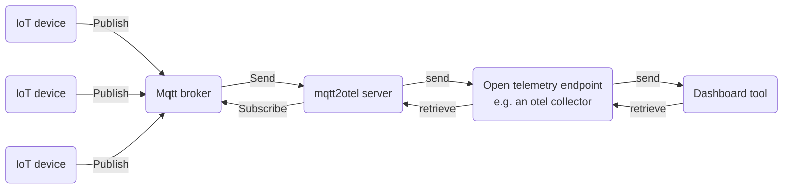

# mqtt2otel

`mqtt2otel` is a powerful yet lightweight bridge between the MQTT messaging protocol—commonly used in the IoT 
(Internet of Things) context—and OpenTelemetry (Otel) protocol, which is typically used for professional application 
and infrastructure monitoring. The tool can subscribe to MQTT broker topics, process and enrich messages with 
additional information, and then generate Otel metrics or logs for further analysis using standard tools.

The basic workflow is as following:



# Documentation

More detailed information is available in the official [documentation](http://NotAvailableYet.de).

# Background

To learn more about the underlying technologies, check out the following resources:

* [Official OpenTelemetry page](https://opentelemetry.io/)
* [Official MQTT page](https://mqtt.org/)

# Getting Started

## Installation

**ToDo**

## Connect to the MQTT Broker and Otel Server

The mapping between MQTT and Otel is configured via a file called `Manifest.yaml`. Here's an example of a simple configuration file that connects to an MQTT broker at `http://mymqtt-broker.net:32007` and an OpenTelemetry collector at `http://my-otel-collector.net:32014`:

```yaml
Version: 1.0

MqttBroker:
  - Name: "My broker"
    Endpoint:
      Port: 32007
      Address: "mymqtt-broker.net"

OtelServer:
  - Name: "My Otel server"
    ServiceName: "my-service"
    ServiceNamespace: "my-service-namespace"
    Endpoint:
      Protocol: "http"
      Port: 32014
      Address: "my-otel-collector.net"
````

This assumes no credentials are required to log into the broker or the Otel collector. For further configuration options, see [Configure MQTT Broker](todo) and [Configure Otel Server](todo).

### Breakdown of the configuration

* **MQTT Broker**:

  * `Name`: An identifier for the MQTT broker.
  * `Endpoint`: Describes the broker's address and port.
* **Otel Server**:

  * `Name`: An identifier for the Otel server.
  * `ServiceName`: The name of the service.
  * `ServiceNamespace`: The namespace for the service.
  * `Endpoint`: Describes the Otel collector's address and port.

## Subscribe to a Topic and Generate a Metric

Now that we have connected to the MQTT broker and Otel server, let's subscribe to an MQTT topic and generate an Otel metric from the payload.

Suppose the server sends messages to the topic `message-topic` in the following JSON format:

```json
{
    "Processor": 
    {
        "Temperature": 42.5
    },
    "TempUnit": "C"
}
```

To extract the temperature, we will use the [JSONPath](https://www.rfc-editor.org/rfc/rfc9535) syntax `$.Processor.Temperature`.
The corresponding YAML would look like this:

```yaml
Processors:
  - Name: "Processor Temperature"
    Description: "Provides the current processor temperature."
    Mqtt: 
      Subscriptions:
        - Name: "Processor information"
          Topic: "message-topic"
    Otel:
      Metrics:
        - Name: "Processor.Temperature"
          Description: "The current processor temperature."
          SignalDataType: Float
          Instrument: Gauge
          Value: "JSONPATH('$.Processor.Temperature')"
```

This configuration subscribes to the MQTT topic `message-topic` and creates an Otel metric called `Processor.Temperature` with 
a `float` data type and a `Gauge` instrument. Every time a message is received for the `message-topic`, the temperature value 
parsed from the provided json and sent to the Otel endpoint.

The syntax is as following:

* Processors contains a list of processors. A processor is able to receive mqtt messages, process them and send them to the
  configured otel endpoint.
* The Processor consists of two parts:
    * Mqtt
        * A list of mqtt topic subscriptions, consisting of
            - A name
            - The topic to which they subscribe.
    * Otel
        * A list of metrics, that should be generated from the message payload. It consists of
            - Name and description
            - The data type of the signal that will be send to the otel endpoint
            - The otel instrument
            - The value of the metric that will be send to the otel endpoint.
            
## Variables and Attributes

Subscriptions can have variables, which can be used later in the rules section. Here’s an example of how to define variables:

```yaml
Mqtt:
  Subscriptions:
    - Name: "Processor information"
      Topic: "message-topic"
      Variables:
        - Key: "SensorName"
          Value: "ProcessorMainServer"
```

You can access variables in Otel rules by prefixing them with a `$` sign. For example, to access the `SensorName`, you would use
`$SensorName`.

Otel rules can also include attributes, which are added to the Otel signal for filtering or grouping. You can use variables
inside attributes where needed. Here’s an example of how to add attributes:

```yaml
Otel:
  Attributes:
    - Key: SensorName
      Value: $SensorName
    - Key: Location
      Value: "Main server room"
  Metrics:
    - Name: "Processor.Temperature"
      Description: "The current processor temperature."
      Attributes:
        - Key: MeasurementQuality
          Value: 10
        - Key: Location
          Value: "Main server room"
      SignalDataType: Float
      Instrument: Gauge
      Value: "JSONPATH('$.Processor.Temperature')"
```

The attributes directly added under the Metrics section will be added to all metrics. The attributes added to the 
"Processor.Temperature" metric will only be added to this metric. 


### Resulting Signal Attributes:

| Attribute Name     | Attribute Value     |
| ------------------ | ------------------- |
| SensorName         | ProcessorMainServer |
| MeasurementQuality | 10                  |
| Location           | Main server room    |

## Working with Expressions

We’ve already used an expression to parse the payload with `JSONPATH('$.Processor.Temperature')`. However, you can also perform 
mathematical transformations. For example, to convert the temperature from Celsius to Fahrenheit, you can use this expression:

```yaml
Value: "(JSONPATH('$.Processor.Temperature') * 1.8) + 32.0"
```

Standard mathematical operations like `+`, `-`, `*`, `/`, and functions such as `SQRT`, `Sin`, `Cos`, `Tan`, and constants 
like `[Pi]` are supported.

### Available Functions

| Function   | Example                   | Description                              |
| ---------- | ------------------------- | ---------------------------------------- |
| `JSONPATH` | `JSONPATH('$.Root')`      | Extracts data using JSONPath syntax      |
| `XPATH`    | `XPATH('/root/child[1]')` | Extracts data using XPath syntax         |
| `REGEX`    | `REGEX('[0-9]+')`         | Extracts data using a regular expression |
| `PAYLOAD`  | `PAYLOAD()`               | Returns the raw payload                  |
| `CONST`    | `CONST('42')`             | Returns a constant value                 |

For more details, please refer to the [documentation](#).

## Log Messages and Transformation

Log messages work similarly to metrics. Let's say you receive a log message payload in the following format from MQTT:

```
2026-02-26T10:28:34Z [Info] [ServerA] Temperature value read successfully.
```

Rather than sending the raw message to Otel, we can transform it into a structured log format using a 
[GROK](https://www.elastic.co/docs/reference/logstash/plugins/plugins-filters-grok) expression.

Here’s how to configure it:

```yaml
Processors:
  - Name: "Server logs"
    Description: "Collect all log messages from the server."
    Mqtt:
      Subscriptions:
        - Name: "Server logs"
          Topic: "message-log-topic"
    Otel:
      Attributes:
        - Key: Location
          Value: MainServerRoom
      Logs:
        - Name: "Logging"
          PayloadType: Json
          Transform: "GROK('%{TIMESTAMP_ISO8601:otel_timestamp} \[%{WORD:otel_loglevel}\] \[%{WORD:server_name}\] %{GREEDYDATA:otel_message}')"
```

You should notice, that we are using the `Logs` keyword now in the otel section to identify log messages. The `Transform` 
expression will convert the log into a JSON structure like this:

```json
{
  "otel_timestamp": "2026-02-26T10:28:34Z",
  "otel_loglevel": "Info",
  "server_name": "ServerA",
  "otel_message": "Temperature value read successfully."
}
```

Since we’ve specified `PayloadType: Json`, Otel will interpret the top-level keys 
(`otel_timestamp`, `otel_loglevel`, `server_name`, and `otel_message`) as attributes in the log message.
Attributes starting with "otel_" will have a special meaning so they are interpreted not as attributes but as the 
message body, timestamp and log level.

## Subscription Groups

To avoid repetition and reuse the same subscriptions across different metrics or logs, you can group them into 
**Subscription Groups** and refer to them later. This is useful when you have e.g. multiple devices or sensors sending data 
under the same topic structure but need to handle them differently in your rules.

### Example Scenario

Let’s say you have a device that sends both power consumption metrics (like current, power, voltage) and status information 
(like the microcontroller core temperature) in the same MQTT message. The message payload is structured as follows:

```json
{
  "Time": "2026-04-12T09:07:04",
  "ENERGY": {
    "Power": 0.000,
    "Voltage": 227,
    "Current": 0.000
  },
  "ESP32": {
    "Temperature": 37.4
  }
}
````

You want to treat power metrics separately from the microcontroller status. To achieve this, you can group the subscriptions 
into a `SubscriptionGroup` for reuse:

### Defining a Subscription Group

```yaml
SubscriptionGroups:
  - Name: "Power sensors"
    Variables:
      - Key: DeviceName
        Value: "My power sensor"
    Subscriptions:
      - Name: "Power Sensor washing machine"
        Topic: "sensor_1234"
        Variables:
          - Key: "SensorName"
            Value: "WashingMachine"
      - Name: "Power Sensor dryer"
        Topic: "sensor_9876"
        Variables:
          - Key: "SensorName"
            Value: "Dryer"
```

Here, we define a **Subscription Group** called `Power sensors`, which includes two subscriptions: 
one for a washing machine and another for a dryer. Both subscriptions have associated variables that can be used later in the 
metrics or logs.

### Using Subscription Groups in Metrics and Logs

Once you’ve created the `Power sensors` group, you can refer to it in your **metrics** or **logs** as follows:

```yaml
Processor:
  - Name: "Power Metrics"
    Description: "Provides power information from a power sensor."
    Mqtt: 
      SubscriptionGroups:
        - Name: "Power sensors"
    Otel:
      Attributes:
        - Key: Type
          Value: "Power metrics"
      Metrics:
        - Name: "Energy_Power_W"
          Description: "The current power consumption at the time of measurement in Watt."
          SignalDataType: Float
          Instrument: Gauge
          Value: "JSONPATH('$.ENERGY.Power')"
        - ...

  - Name: "Processor Status"
    Description: "Provides processor status from the power sensor."
    Mqtt: 
      SubscriptionGroups:
        - Name: "Power sensors"
    Otel:
      Attributes:
        - Key: Type
          Value: "Processor metrics"
      Metrics:
        - Name: "ESP32_Temperature"
          Description: "The current temperature of the ESP32 microcontroller."
          SignalDataType: Float
          Instrument: Gauge
          Value: "JSONPATH('$.ESP32.Temperature')"
        - ...
```

In this example:

* **Power Metrics**: We create a metric for power data (e.g., `Power`, `Voltage`), subscribing to the `Power sensors` group.
* **Processor Status**: We create another metric for processor data (e.g., `Temperature`), also subscribing to the same `Power sensors` group.

Both metrics will use different attributes.

### Grouping Devices with Different Topics

Sometimes, devices may use different MQTT topics but contain the same identifier. For example, you might have multiple topics 
for each sensor:

| Sensor | Topic              | Description                   |
| ------ | ------------------ | ----------------------------- |
| 1234   | `tele/1234/sensor` | Power metrics for sensor 1234 |
| 1234   | `stat/1234/logs`   | Logs for sensor 1234          |
| 9876   | `tele/9876/sensor` | Power metrics for sensor 9876 |
| 9876   | `stat/9876/logs`   | Logs for sensor 9876          |

To manage these different topics, you can group them under a common **Subscription Group** and then specify **ParentPath** 
and **SubPath** to correctly target the topics.

### Defining Subscription Groups with ParentPath and SubPath

```yaml
SubscriptionGroups:
  - Name: "Power sensors"
    Subscriptions:
      - Name: "Power Sensor 1"
        Topic: "1234"
      - Name: "Power Sensor 2"
        Topic: "9876"

Processors:
  - Name: "Power Metrics"
    Description: "Provides power information from a power sensor."
    Mqtt: 
      SubscriptionGroups:
        - Name: "Power sensors"
          ParentPath: "tele"
          SubPath: "sensor"
    Otel:
      Metrics:
        - Name: "Energy_Power_W"
          Description: "The current power consumption at the time of measurement in Watt."
          SignalDataType: Float
          Instrument: Gauge
          Value: "JSONPATH('$.ENERGY.Power')"
        - ...

  - Name: "Sensor Logs"
    Description: "Collect all log messages from the sensors."
    Mqtt:
      SubscriptionGroups:
        - Name: "Power sensors"
          ParentPath: "stat"
          SubPath: "logs"
    Otel:
      Logs:
        - Name: "Logging"
          PayloadType: Json
          Transform: "GROK('%{TIME:otel_timestamp} %{WORD:category}: %{GREEDYDATA:otel_message}')"
```

### Explanation:

* **ParentPath**: This specifies the top-level directory or prefix of the topic. For example, `tele` for telemetry data or `stat` for status/log data.
* **SubPath**: This specifies the specific subtopic or suffix that targets a specific part of the topic.

#### Example with the above configuration:

* The **Power Metrics** rule will subscribe to topics like `tele_1234_sensor` and `tele_9876_sensor` using the `ParentPath` `tele` and `SubPath` `sensor`.
* The **Sensor Logs** rule will subscribe to topics like `stat_1234_logs` and `stat_9876_logs` using the `ParentPath` `stat` and `SubPath` `logs`.

### Final Thoughts

By using **Subscription Groups**, you can easily reuse configurations across different rules, making your setup more modular 
and scalable. Grouping devices and topics this way allows you to handle complex MQTT topic structures efficiently.

For further details, please refer to the [documentation](#).

## Complete example manifest

Here is a complete minimal example manifest using logs, and metrics:

```yaml
Version: 1.0

MqttBroker:
  - Name: "My broker"
    Endpoint:
      Port: 32007
      Address: "mymqtt-broker.net"

OtelServer:
  - Name: "My Otel server"
    ServiceName: "my-service"
    ServiceNamespace: "my-service-namespace"
    Endpoint:
      Protocol: "http"
      Port: 32014
      Address: "my-otel-collector.net"

Processors:
  - Name: "Processor Temperature"
    Description: "Provides the current processor temperature."
    Mqtt: 
      Subscriptions:
        - Name: "Processor information"
          Topic: "message-topic"
    Otel:
      Metrics:
        - Name: "Processor.Temperature"
          Description: "The current processor temperature."
          SignalDataType: Float
          Instrument: Gauge
          Value: "JSONPATH('$.Processor.Temperature')"

  - Name: "Server logs"
    Description: "Collect all log messages from the server."
    Mqtt:
      Subscriptions:
        - Name: "Server logs"
          Topic: "message-log-topic"
    Otel:
      Attributes:
        - Key: Location
          Value: MainServerRoom
      Logs:
        - Name: "Logging"
          PayloadType: Json
          Transform: "GROK('%{TIME:otel_timestamp} [%{WORD:otel_loglevel}] [%{WORD:server_name}] %{GREEDYDATA:otel_message}')"

````

Happy building! :-)

