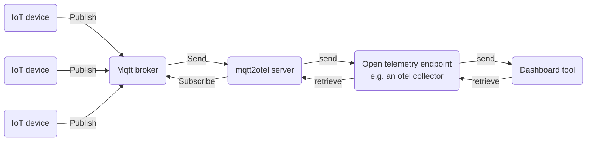

  

# mqtt2otel

`mqtt2otel` is a powerful yet lightweight bridge between the MQTT messaging protocol—commonly used in the IoT 
(Internet of Things) context—and OpenTelemetry (Otel) protocol, which is typically used for professional application 
and infrastructure monitoring. The tool can subscribe to MQTT broker topics, process and enrich messages with 
additional information, and then generate Otel metrics or logs for further analysis using standard tools.

The basic workflow is as following:

# Homepage

You can find the official homepage of the project [here](https://mqtt2otel.org).

# Quickstart

If you want to get started fast, have a look at our [quickstart guide](http://localhost:1313/docs/introduction/quickstart/).

# Documentation

More detailed information is available in the official [documentation](https://mqtt2otel.org/docs/introduction/).

# Background

To learn more about the underlying technologies, check out the following resources:

* [Official OpenTelemetry page](https://opentelemetry.io/)
* [Official MQTT page](https://mqtt.org/)
