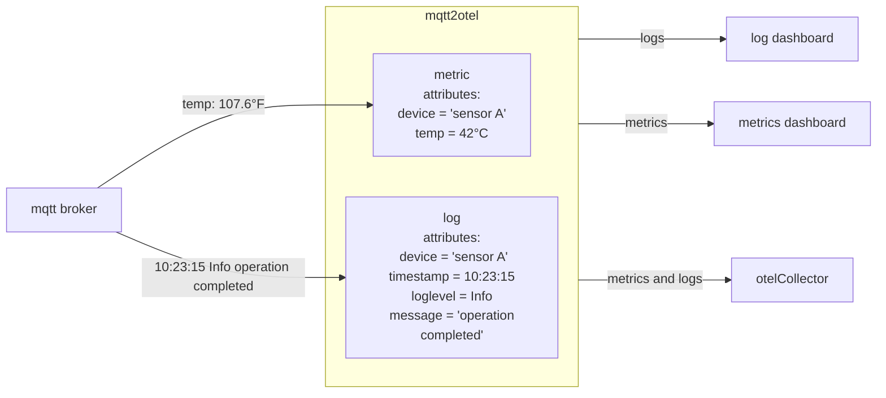
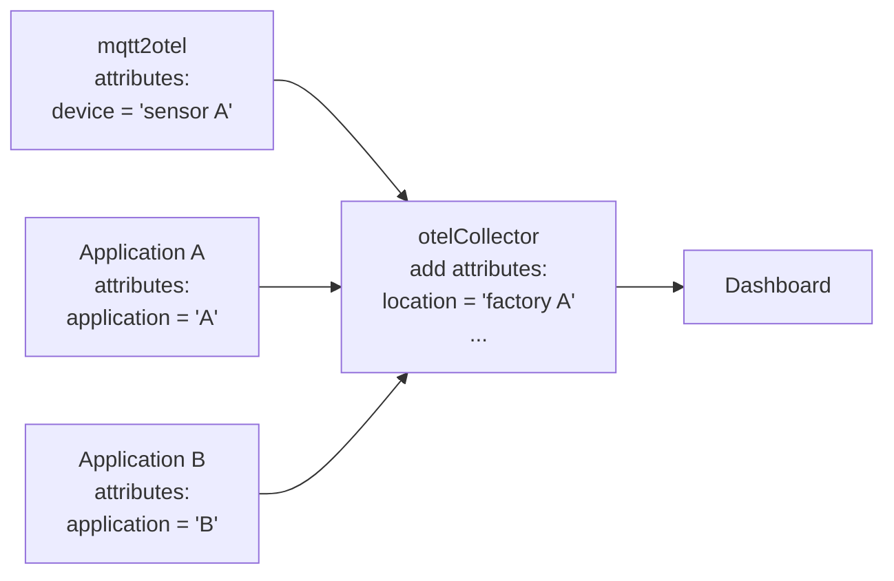
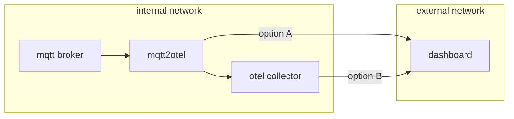
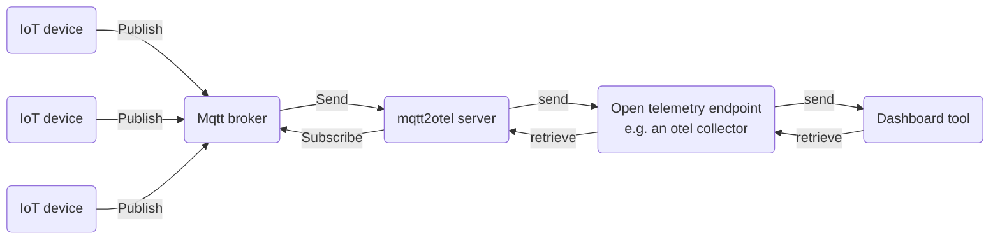

  

# mqtt2otel {anchor=false}

`mqtt2otel` is a powerful yet lightweight bridge between the MQTT messaging protocol, commonly used in the IoT 
(Internet of Things) context, and OpenTelemetry (Otel) protocol, which is typically used for professional application 
and infrastructure monitoring. The tool can subscribe to MQTT broker topics, process and enrich messages with 
additional information, and then generate Otel metrics or logs for further analysis using standard tools.

{}
- 
  ## Best of both worlds
  Combine the power of low energy, light weight IOT communication used at millions of devices worldwide with the de facto industry standard of professional telemetry.
  

- 
  ## Enrich your data
  You can add additional data to your telemetry signals, name them, add descriptions, locations, manufactorers, capabilities or others.
  

- 
  ## Create dashboards with ease
  Open telemetry is the de facto standard for telemetry data and is supported by all major dashboard tools.
  
{}

# Why mqtt2otel?

IoT systems often rely on MQTT for efficient communication, while modern applications use OpenTelemetry for monitoring and observability. 
**mqtt2otel bridges this gap**, enabling you to bring IoT data into your existing observability stack without custom integrations.

## Use cases

You may ask yourself, why should you send your mqtt payloads via mqtt2otel, instead of providing them to a dashboard tool directly. There are
several reasons to do so:

1. Your dashboard tool may not support mqtt directly
1. You want to enrich data with attributes and further process the data, but your dashboard tool does not support that, or only 
   supports that behind a paywall.

More complex use cases involve:

### Data distribution

mqtt2otel is able to parse payloads and enrich them with attributes. It can process the data (e.g. convert to different units) and then distribute 
it to different otel endpoints that are optimized for different use cases.

### Integrate into existing otel infrastructure

mqtt2otel integrates well into existing open telemetry infrastructure. In the presented example this is used to aggregate data from different 
otel sources and enrich it with further attributes, before sending it to a dashboaard tool.

### Manage load

mqtt2otel can be used to aggregate and batch data before it is send out to the internet to reduce network traffic [option A]. Alternatively
it can use an existing otel collector infrastructure to do this [option B]. mqtt2otel can communicate asynchronously and synchronously 
giving additional options on how the load on the target node can be managed. This can significantly reduce pressure on the dashboard tool.

# Background

To learn more about the underlying technologies, check out the following resources:

* [Official OpenTelemetry page](https://opentelemetry.io/)
* [Official MQTT page](https://mqtt.org/)

# Architecture

mqtt2otel does not include an embedded MQTT broker or OpenTelemetry Collector. These components must be provided externally (this may change in future versions).

A typical setup looks like this:

# Installation

Installation instructions can be found in the [documentation](https://mqtt2otel.org/docs/installation/).

# Documentation

Please refer to the official [documentation](/docs/introduction) for further info.

# Source code

mqtt2otel is open source. The source code is available on [GitHub](https://github.com/OSgAgA/mqtt2otel).

# Feedback

If you would like to report an issue or propose an enhancement, you can do this on [GitHub](https://github.com/OSgAgA/mqtt2otel/issues).

If you would like to join or start a discussion, or ask a question then welcome to our [discussions page](https://github.com/OSgAgA/mqtt2otel/discussions).