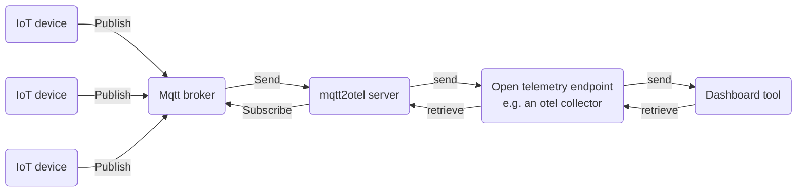

  

# mqtt2otel {anchor=false}

`mqtt2otel` is a powerful yet lightweight bridge between the MQTT messaging protocol, commonly used in the IoT 
(Internet of Things) context, and OpenTelemetry (Otel) protocol, which is typically used for professional application 
and infrastructure monitoring. The tool can subscribe to MQTT broker topics, process and enrich messages with 
additional information, and then generate Otel metrics or logs for further analysis using standard tools.

{}
- 
  ## Best of both worlds
  Combine the power of low energy, light weight IOT communication used at millions of devices worldwide with the de facto industry standard of professional telemetry.
  

- 
  ## Enrich your data
  You can add additional data to your telemetry signals, name them, add descriptions, locations, manufactorers, capabilities or others.
  

- 
  ## Create dashboards with ease
  Open telemetry is the de facto standard for telemetry data and is supported by all major dashboard tools.
  
{}

# Background

To learn more about the underlying technologies, check out the following resources:

* [Official OpenTelemetry page](https://opentelemetry.io/)
* [Official MQTT page](https://mqtt.org/)

## The setup

Currently mqtt2otel is not shipping an internal mqtt broker or an otel-collector. These tools have to be provided separatly. This may change in future versions.

So a typical setup for using this tool may look like this:

# Documentation

Please refer to the official [documentation](/docs/introduction) for further info.

# Source code

mqtt2otel is open source. The source code is available on [GitHub](https://github.com/OSgAgA/mqtt2otel)