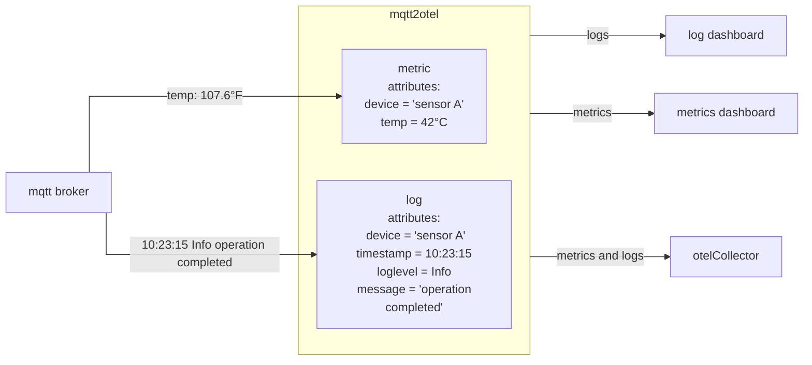

  

# mqtt2otel {anchor=false}

`mqtt2otel` is a powerful yet lightweight bridge between the MQTT messaging protocol, commonly used in the IoT 
(Internet of Things) context, and OpenTelemetry (Otel) protocol, which is typically used for professional application 
and infrastructure monitoring. The tool can subscribe to MQTT broker topics, process and enrich messages with 
additional information, and then generate Otel metrics or logs for further analysis using standard tools.

{}
- 
  

  ## Best of both worlds
  Combine the power of low energy, light weight IOT communication used at millions of devices worldwide with the de facto industry standard of professional telemetry.
  

- 
  

  ## Enrich your data
  You can add additional data to your telemetry signals, name them, add descriptions, locations, manufactorers, capabilities or others.
  

- 
  

  ## Create dashboards with ease
  Open telemetry is the de facto standard for telemetry data and is supported by all major dashboard tools.
  
{}

# Overview

```mermaid
---
config:
  flowchart:
    curve: stepBefore
---

flowchart LR
  mqttBroker[mqtt broker]
  subgraph mqtt2otel
    mqtt2otelmetric[metric<br/>attributes:<br/> device = 'sensor A'<br/>temp = 42°C]
    mqtt2otellog[log<br/>attributes:<br/> device = 'sensor A'<br/>timestamp = 10:23:15<br/>loglevel = Info<br/> message = 'operation completed']
  end
  otelCollector[otelCollector]
  metricsDashboard[metrics dashboard]
  logDashboard[log dashboard]
  
  mqttBroker -->|temp: 107.6°F| mqtt2otelmetric
  mqttBroker -->|10:23:15 Info operation completed| mqtt2otellog
  mqtt2otel -->|logs| logDashboard
  mqtt2otel -->|metrics| metricsDashboard
  mqtt2otel -->|metrics and logs| otelCollector
```

mqtt2otel is able to parse payloads and enrich them with attributes. It can process the data (e.g. convert to different units) and then distribute 
it to different otel endpoints that are optimized for different use cases.

# Get started

{}
- 

  ### **Documentation**
  
  Want to learn more? mqtt2otel has an extensive documentation available. Useful starting points are:

    - The official [documentation](/docs/introduction).
    - The [quickstart](/docs/introduction/quickstart) guide.
    - [Installation instructions](https://mqtt2otel.org/docs/installation/)

  For further questions, please have a look at [GitHub](https://github.com/OSgAgA/mqtt2otel/issues).

  

- 
  

  

{}

{}
- 
  

  

- 

  ### **mqtt2otel explorer**
  Reading documentation tends to get boring? No worries. We got you covered.

  [mqtt2otel explorer](https://explorer.mqtt2otel.org) lets you simulate MQTT messages, experiment with processors, and instantly see how your data 
  is transformed. 
  
  The Explorer also includes an [example library](https://explorer.mqtt2otel.org/examples) full of ready‑to‑use patterns and ideas. 
  
  Wherever the [documentation](/docs/introduction) contains an example, you can jump directly into the Explorer via the integrated button and inspect 
  the example interactively.

  
{}

{}
- 

  ### **Further information**
  mqtt2otel is open source. Feel free to have a deeper look into the code. The source code is available on [GitHub](https://github.com/OSgAgA/mqtt2otel).

  **Feedback**

  If you would like to report an issue or propose an enhancement, you can do this on [GitHub](https://github.com/OSgAgA/mqtt2otel/issues).

  If you would like to join or start a discussion, or ask a question then welcome to our [discussions page](https://github.com/OSgAgA/mqtt2otel/discussions).
  

- 
  

  

{}

{}
- 
  

  

- 

  ### **Background**

  To learn more about the underlying technologies, check out the following resources:

    * [Official OpenTelemetry page](https://opentelemetry.io/)
    * [Official MQTT page](https://mqtt.org/)

  
{}