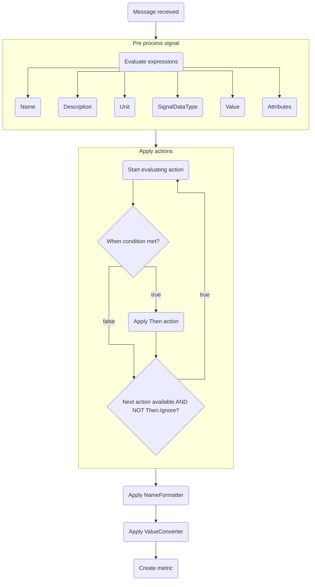
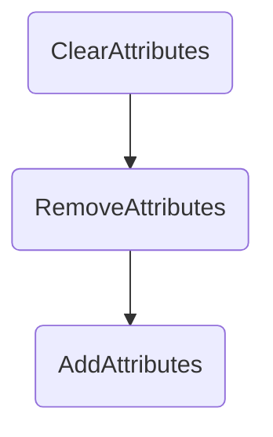

# Metric actions

Metric processors support the concept of actions, that can interfere with how (and if) a signal is created.
A transformation consists of two parts:

1. The condition (`When`) - Checks whether a generated metric signal matches certain conditions
1. The action (`Then`) - Executes an action when the condition is met.

Transformations will be executed after the signal is generated, but before a value converter or a name formatter is applied..

## The condition

A condition consists of an expression that must evaluate to true to pass the test. The expression gets the following variables set:

| Variable                           | Description                                                                                |
|------------------------------------|--------------------------------------------------------------------------------------------|
| Name                               | The signal name, that has been evaluated in the previous step               				  |
| Value                              | The signal value, that has been evaluated in the previous step     						  |
| Type                               | The signal type, that has been evaluated in the previous step                              |

## The action

The transformation action, will set properties on the signal, when the condition returned true. 
It consists of the following properties, properties that are not set, will keep their original state:

| Parameter         | Description                                                                                                                                      |
|-------------------|--------------------------------------------------------------------------------------------------------------------------------------------------|
| Name              | The name of the created signal.                                          |
| Unit              | The unit.	                                                               |
| Description       | The description.                                                         |
| NameFormatter     | The name formatter.                                                                                                                              |
| ValueConverter    | The value converter.                                                                                                                             |
| SignalDataType    | The signal data type.                                                                                                                            |
| Instrument        | The otel instrument.                                                                                                                             |
| Ignore            | If set to true, then the signal will be skipped and not further processed. Any following actions will not be evaluated.                          |
| ClearAttributes   | Set to true to clear all the attributes from the signal. Will be executed before new attributes are added via `AddAttributes`.                   |
| AddAttributes     | Adds the provided attributes to the signal. .                            |
| RemoveAttributes  | A list of attribute keys, that should be removed. If the key is not found it is ignored. Attributes are removed before new attributes are added. |
| Output            | An output message that will be written to the standard log.                                                                                      |
| Output.Message    | The message that should be written                                                                                                               |
| Output.Level      | The log level of the message: Debug, Trace, Information, Warninbg, Error, Critical                                                               |
| Output.Attributes | A dictionary of additional attributes that will be added to the log message.                                                                     |

## Example

Let's have a look at the following example. We get a message that contains different information from different kind of sensors and 
additionaly a unit for the temperature measurement:



We want this to be automatically parsed using a `ParseAs` command, but we want all temperatures to be in °C. So we set the unit accordingly.
In case the temperature unit is reported as °F we will convert the value to °C using a `ValueConverter`:



## Processing pipeline

To understand actions in detail it is important to understand how the processing pipeline works:

* First the received message is preprocessed by the processor, so a name, a unit, a description, the type and the value is created
* Then the actions are applied, if the `When` Condition is successful. If any action return `Ignore`: true, no further actions are applied.
* After all actions are applied the signal name is formatted using the `NameFormatter`.
* Then the signal value is converted using the `ValueConverter`.
* Then the metric is send.

When changing the attributes of a pre processed signal the pipeline is as following:

So attributes added via `AddAttributes`are never removed by either `ClearAttributes` or `RemoveAttributes`.